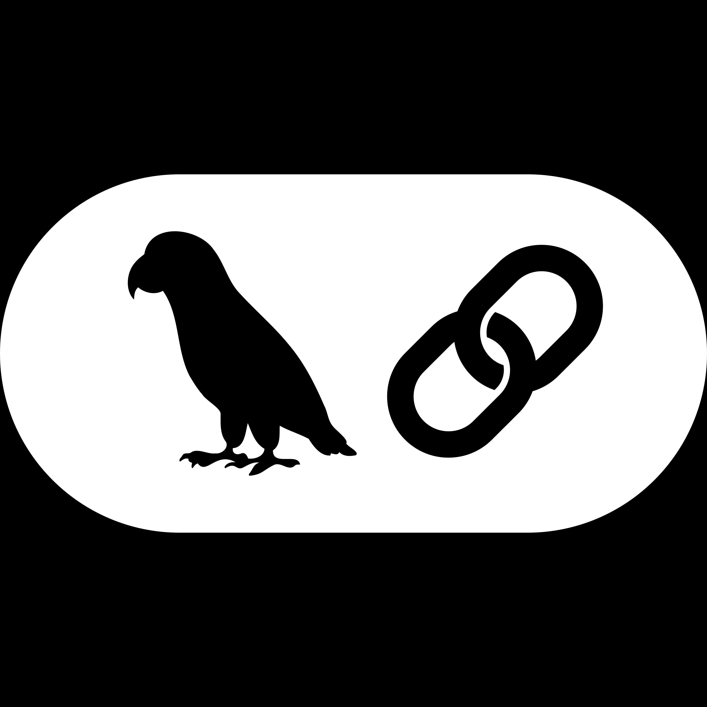

<h1 align="center">Hi there, I'm Ayush VaZe 👋</h1>  
<h3 align="center">Aspiring Machine Learning & Data Science Professional | App Developer | Problem Solver</h3>      

---          
## 🎯 Career Objective       
 
Aspiring data scientist with a strong foundation in computer engineering and hands-on experience in machine learning and deep learning. Recently completed training in ML, DL, and GenAI, and currently deepening my expertise in data science. Enthusiastic about computer vision, with a keen interest in OpenCV and YOLO for image and video-based applications. Also experienced in developing intuitive Android and cross-platform apps with integrated AI features. Passionate about turning data into practical, impactful solutions.
 
---   
  
## 🛠 Tech Stack  
 
### 👨‍💻 Languages 

  
  
  
  
  
  
  

### 🧩 Frameworks & Libraries  

  
  
  
  
  
  
  
  
  <!--  -->
  
  
  
  
  
  

### 🛠 IDEs, Platforms & Tools

  
  
  
  
  
  
  

### 📜 Skills
- **Programming Languages:** Python, Java, Dart, JavaScript, SQL  
- **Frameworks/Tools:** Android, Flutter, Firebase, Flask, FastAPI
- **Libraries/Technologies:** Pandas, NumPy, Matplotlib, Seaborn, Scikit-Learn, OpenCV, TensorFlow, Mediapipe  
- **Machine Learning:** Supervised Learning, Unsupervised Learning, Statistics, Model Deployment  
- **Deep Learning:** CNN, RNN, LSTM, YOLO, Transfer Learning, Transformers
- **GenAI:** Langchain, HuggingFace
- **Soft Skills:** Communication, Teamwork, Problem Solving, Time Management, Leadership  

---

## 🏅 GitHub Achievements 

  
  
  
  

 
 
--- 

## 📊 GitHub Stats 

 

---

## 📫 Connect with Me

  
  
  
  

